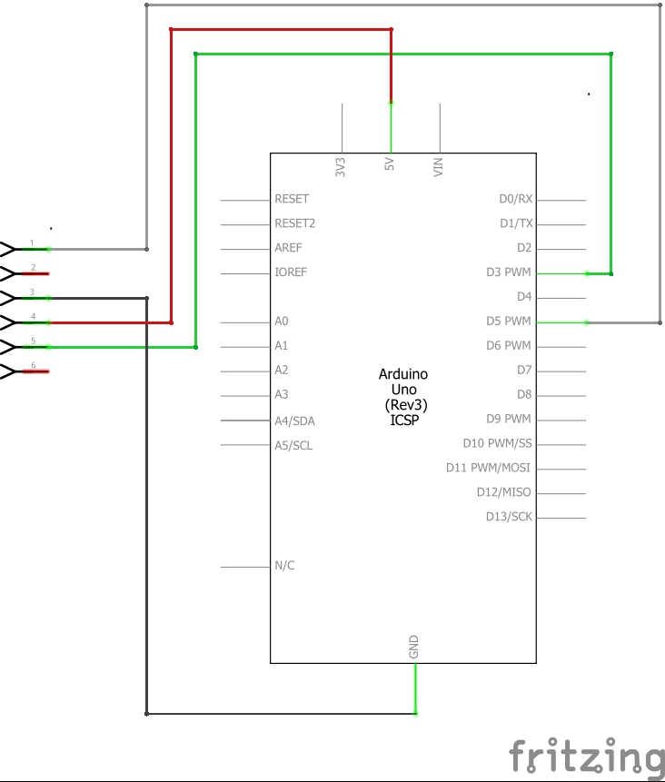

## About

Simon Types is a memory game which shows a random sequence of characters on an LCD screen which should be entered by the user correctly using a keyboard. The score of the user will increase with each correct answer and also the complexity level of the game increases after particular number of correct answers. The game will be over once the user enters an incorrect answer.

## Required Components

1 Arduino Uno Board  
2 PS2 Keyboard 
3 LCD Screen (MI0283QT)  
4 Jumper wires x 4  
5 Breadboard  

## Schematic

## Functional Requirements

1 Show the message "Press Enter to Start" until the user presses the "Enter Key" 
2 Show the message "Select Level 1 to 5" until the user gives a number between 1 to 5 
3 Set score = 0 
4 Show a random sequence with (level + 4) number of characters for 2 seconds 
5 Hide the sequence and prompt the user to enter the sequence  
6 If the user enters the correct sequence increment the score by 1 (ie score++) else if the answer is wrong go to step 9 
7 If the score is a multiple of 5 (ie score % 5 == 0) increment level by 1 (ie level++)  
8 Go to Step 4	 
9 Show the message "Game Over" 

## Reference

https://playground.arduino.cc/Main/PS2Keyboard  
http://learn.watterott.com/mi0283qt-adapter/  

	

