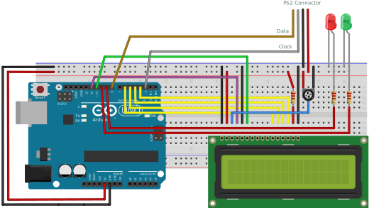

# Simon Types
RCSE Embedded Systems Lab 2018

## Breadboard

## Required Components

1 Arduino Uno Board  
2 LCD Screen (compatible with Hitachi HD44780 driver) with PIN headers  
3 10k ohm potentiometer  
4 220 ohm resistor x 3  
5 Jumper wires x 25  
6 Breadboard  
7 PS2 Keyboard 
8 PS2 Connector 
9 Red LED  
10 Green LED  

## Functional Requirements

1 Show the message "Press Enter to Start" until the user presses the "Enter Key" 
2 Show the message "Select Level 1 to 5" until the user gives a number between 1 to 5 
3 Set score = 0 
4 Show a random sequence with (level + 5) number of characters for 2 seconds 
5 Hide the sequence and prompt the user to enter the sequence  
6 If the user enters the correct sequence increment the score by 1 (ie score++) and enable Green LED else if the answer is wrong, enable the Red LED and go to step 10  
7 If the score is a multiple of 5 (ie score % 5 == 0) increment level by 1 (ie level++)  
8 Disable Green LED and Go to Step 4	 
9 If the user presses "Space Key" to restart the game go to Step 2  
10 Disable Red LED and Show the message "Game Over" along with score  

## Reference

https://www.arduino.cc/en/Tutorial/HelloWorld  
https://www.pjrc.com/teensy/td_libs_PS2Keyboard.html  

	

